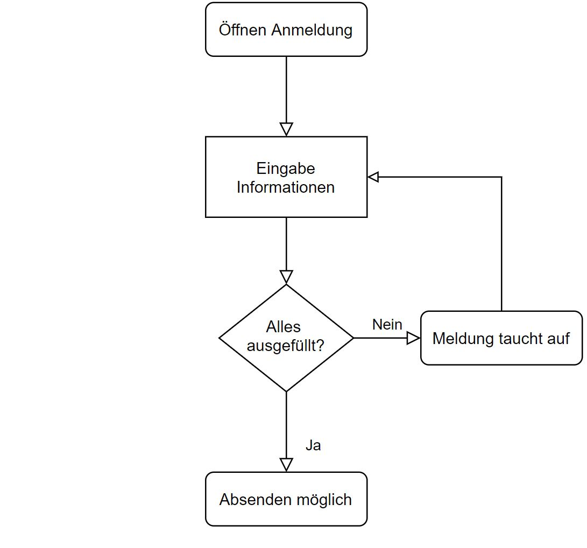

**Projektidee Andrin Krieg**  

**Ausgangslage**  
Seit Ende September 2019 bin ich Vorstandspräsident eines Pferdesportwettbewerbs der jährlich stattfindet. Meine Aufgabe ist sehr einfach: Ich organisiere O.K. Sitzungen und muss am Eventwochenende rumlaufen und 'nach dem rechten schauen'. Das ganze (von Organisation, bis zu Anmeldung) ist das Ganze sehr veraltet und überarbeitungsbedürftig.

**Idee**  
Meine Idee ist es den Anmeldeprozess und die damit verbundenen Nebenprozessse zu digitalisieren. Ein User sollte sich mit 1-2 Pferden für Mehrere Prüfungen anmelden können. Idealerweise wird eine Liste generiert und ist dann als 'Startliste' auswertbar.

**Weiterfühurng**  
In einer Weiterführung könnte zudem die App so weiterentwickelt werden, sodass die Anmeldeliste von der Jury benutzt werden kann um die Resultate direkt (live), nach dem absolvierten Parcour, eizugeben. Diese ist wiederrum dann auch als Rangliste aufrufbar.

**Anforderungen**  
- Einlesen Angaben Reiter, Pferd und Prüfungen
- Ausgabe einer Liste für Organisatoren
- Zurückführung auf Homepage oder Erfassung weiterer Anmeldung

**Flussdiagramm**  

